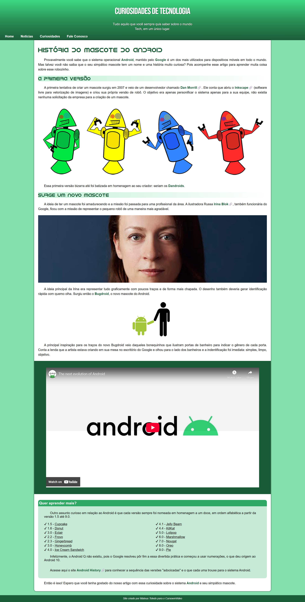

# site-android

My first website, developed after completing modules 1 and 2 of the course of HTML5 + CSS3 from CursoemVídeo, taught by Gustavo Guanabara.

I did my best to ensure that the website was responsive, following the guidelines proposed by the course instructor.

With the project, I was able to consolidate the content learned, from basic HTML5 and CSS3 fundamentals to website responsiveness.

## Access Here

<a href="https://mttoledo.github.io/site-android/">Visit the project</a>

## Screenshots

  

## Updates

I've made some changes to the project to fix an issue related to the website's navigation (nav). I transformed the nav container into a flex container, allowing <a> links to align properly and preventing them from breaking into multiple lines. Additionally, I created a media query to apply reductions in font size and padding, as well as to center the nav tags on devices with screen widths less than 600px.
